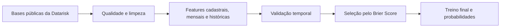

# Previsão de Inadimplência — Case Datarisk

Solução de Machine Learning para estimar a probabilidade de atraso em cobranças, desenvolvida a partir do [case técnico oficial de Ciência de Dados Júnior da Datarisk](https://github.com/datarisk-io/datarisk-case-ds-junior).

O projeto foi estruturado como um problema real de risco de crédito: investiga a qualidade dos dados, previne vazamento temporal, cria histórico comportamental e avalia não apenas o poder de ranking do modelo, mas também a qualidade das probabilidades previstas.

## Resultado

O modelo selecionado foi um `HistGradientBoostingClassifier`, avaliado em quatro safras futuras que não participaram do treinamento.

| Métrica | Resultado |
|---|---:|
| AUC | 0,9416 |
| Gini | 0,8832 |
| KS | 0,7494 |
| Brier Score | **0,0333** |

O **Brier Score** foi usado como critério principal porque a aplicação exige probabilidades úteis, e não apenas uma boa ordenação dos clientes por risco.

### Principais decisões

- Validação temporal em vez de divisão aleatória.
- Features históricas construídas somente com safras anteriores à cobrança.
- Remoção de 51 registros de desenvolvimento com datas inconsistentes e target não confiável.
- Tratamento semântico de valores ausentes em `FLAG_PF` e `SEGMENTO_INDUSTRIAL`.
- Comparação entre regressão logística e três configurações de Gradient Boosting.
- Seleção pela qualidade das probabilidades, sem balanceamento ou calibração que piorassem o Brier Score.

## Problema de negócio

A unidade de previsão é a **cobrança**. Uma observação é classificada como inadimplente quando o pagamento ocorre com atraso de pelo menos cinco dias:

```text
INADIMPLENTE = 1 quando DATA_PAGAMENTO - DATA_VENCIMENTO >= 5 dias
```

O modelo gera `PROBABILIDADE_INADIMPLENCIA` para cada cobrança da base de teste, permitindo priorizar ações proativas de cobrança.

## Abordagem



### Validação temporal

As safras de março a junho de 2021 foram reservadas para validação. O treino utilizou somente dados até fevereiro de 2021, simulando o cenário de previsão de meses futuros.

| Conjunto | Período | Registros |
|---|---|---:|
| Treino | 2018-08 a 2021-02 | 67.640 |
| Validação | 2021-03 a 2021-06 | 9.723 |

Depois da seleção, o modelo final é treinado com todo o desenvolvimento válido e aplicado às safras de teste de julho a novembro de 2021.

### Controle de vazamento

- `DATA_PAGAMENTO` é usada somente para construir o target no desenvolvimento.
- O histórico de uma cobrança utiliza apenas safras estritamente anteriores.
- A importância das variáveis é calculada antes do refit final, preservando uma validação realmente não vista.

### Feature engineering

As variáveis foram organizadas em quatro grupos:

1. **Cobrança:** valor, taxa, prazo e características da emissão.
2. **Cadastro:** porte, segmento, domínio de e-mail, DDD, região e tempo de relacionamento.
3. **Informação mensal:** renda do mês anterior e número de funcionários.
4. **Comportamento:** quantidade de cobranças anteriores, taxa histórica de inadimplência, atraso médio, valor médio e inadimplência na última safra.

Entre as features derivadas estão:

- `CLIENTE_SEM_HISTORICO`;
- `INADIMPLENCIA_ULTIMA_SAFRA`;
- `VALOR_RENDA_RATIO_CAP`;
- `CADASTRO_ATIPICO`;
- `PRAZO_ATIPICO`.

## Qualidade dos dados

A análise identificou decisões que afetavam diretamente a confiabilidade do modelo:

- **Datas inconsistentes:** 51 cobranças tinham prazo entre emissão e vencimento negativo ou superior a 400 dias. A inadimplência nesse grupo era próxima de 59%, contra cerca de 7% na base geral, indicando ruído no target. Esses registros foram removidos somente do desenvolvimento; nenhuma linha do teste é descartada.
- **PF e PJ:** no dicionário oficial, `FLAG_PF = X` identifica pessoa física e o valor ausente representa pessoa jurídica. A solução recodifica explicitamente as duas categorias.
- **Segmento industrial:** valores ausentes de pessoas físicas recebem `NAO_APLICAVEL_PF`, separados de empresas com segmento não informado.
- **Cadastro atípico:** cobranças emitidas antes da data de cadastro recebem uma flag específica, e o tempo como cliente é limitado a zero.
- **Info mensal ausente:** aproximadamente 7,9% das cobranças não possuem informação mensal e são sinalizadas para o pipeline.
- **Região:** os DDDs são convertidos para as cinco regiões brasileiras, incluindo 98 e 99 corretamente no Nordeste.

## Comparação dos modelos

| Modelo | AUC | Gini | KS | Brier |
|---|---:|---:|---:|---:|
| **HGB cfg3** | 0,9416 | 0,8832 | 0,7494 | **0,0333** |
| HGB cfg2 | 0,9417 | 0,8833 | 0,7411 | 0,0334 |
| HGB cfg1 | 0,9428 | 0,8856 | **0,7602** | 0,0337 |
| Regressão logística | 0,9111 | 0,8223 | 0,7114 | 0,1046 |

Configuração escolhida:

```python
HistGradientBoostingClassifier(
    max_leaf_nodes=31,
    min_samples_leaf=50,
    learning_rate=0.03,
    max_iter=220,
    l2_regularization=0.05,
    random_state=42,
)
```

O modo estendido também reproduz experimentos com `sample_weight` balanceado e calibração isotônica. Essas alternativas foram mantidas para transparência experimental, mas não integram o fluxo padrão porque pioraram a qualidade das probabilidades.

### Variáveis mais importantes

A importância por permutação na validação destacou:

1. `VALOR_A_PAGAR`;
2. `TAXA_INADIMPLENCIA_HIST`;
3. `INADIMPLENCIA_ULTIMA_SAFRA`;
4. `ATRASO_MEDIO_HIST`;
5. `N_INADIMPLENCIAS_ANTERIORES`.

O resultado é coerente com o problema: o valor da exposição e o comportamento de pagamento anterior concentram o maior sinal de risco.

## Como reproduzir

Requisitos: Python 3.10 ou superior.

1. Clone este repositório e instale as dependências:

   ```bash
   pip install -r requirements.txt
   ```

2. Baixe as quatro bases na pasta `data` do [repositório oficial da Datarisk](https://github.com/datarisk-io/datarisk-case-ds-junior/tree/master/data) e coloque-as na raiz deste projeto:

   ```text
   base_cadastral.csv
   base_info.csv
   base_pagamentos_desenvolvimento.csv
   base_pagamentos_teste.csv
   ```

3. Execute o fluxo padrão:

   ```bash
   python solution.py
   ```

O comando compara a baseline e os três modelos HGB, treina o modelo escolhido e gera `submissao_case.csv` localmente.

Para reproduzir também os experimentos de balanceamento e calibração:

```bash
python solution.py --extended
```

## Integração com Supabase

A integração é opcional e mantém o fluxo padrão inalterado. Quando ativada, registra uma execução em `prediction_runs` e envia todas as probabilidades para `credit_risk_predictions`, preservando a ordem original da submissão.

### Configuração

1. Crie as tabelas executando [`supabase/schema.sql`](supabase/schema.sql) no SQL Editor do projeto Supabase. O script ativa RLS, remove acesso de `anon` e `authenticated` e concede acesso somente a `service_role`.
2. Copie `.env.example` para `.env` e preencha os valores do seu projeto:

   ```bash
   cp .env.example .env
   ```

   ```dotenv
   SUPABASE_URL=https://your-project-ref.supabase.co
   SUPABASE_SECRET_KEY=sb_secret_your_secret_key
   ```

3. Execute o pipeline com o envio habilitado:

   ```bash
   python solution.py --upload-supabase
   ```

O envio acontece somente depois que o CSV passa pelas validações de linhas, colunas, valores nulos e intervalo das probabilidades. As inserções são feitas em lotes e cada execução recebe um UUID próprio.

### Segurança

- `.env` e suas variações estão no `.gitignore`; apenas `.env.example`, sem valores reais, é versionado.
- Use preferencialmente uma chave moderna `sb_secret_*`. A chave legada `service_role` também funciona no script local.
- Nunca use essa chave em frontend, notebook público, commit, log ou variável com prefixo público.
- As tabelas têm RLS habilitada e não possuem políticas para acesso público. Uma chave publishable/anon é rejeitada pelo próprio script.

## Estrutura

```text
.
├── .env.example
├── README.md
├── requirements.txt
├── solution.py
├── supabase_io.py
└── supabase/
    └── schema.sql
```

As bases e o arquivo de submissão não são versionados. Eles já estão disponíveis publicamente na fonte oficial ou podem ser reproduzidos pela execução do código.

## Limitações e próximos passos

- Clientes novos dependem de features cadastrais, mensais e de uma flag de ausência de histórico.
- O histórico do teste é um snapshot até junho de 2021; em produção, ele deve ser atualizado a cada safra concluída.
- A estabilidade das probabilidades e das principais features deve ser monitorada mensalmente.
- O modelo deve ser retreinado conforme novos resultados de pagamento se tornem disponíveis.

## Fonte e contexto

Este é um projeto independente de portfólio baseado no [case público da Datarisk](https://github.com/datarisk-io/datarisk-case-ds-junior). O repositório oficial autoriza manter a solução em um repositório pessoal para esse fim. A Datarisk não participou da implementação e não endossa esta solução.

