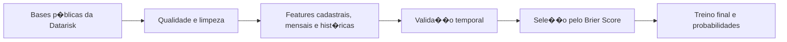

# Previs�o de Inadimpl�ncia - Case Datarisk

Solu��o de Machine Learning para estimar a probabilidade de atraso em cobran�as, desenvolvida a partir do [case t�cnico oficial de Ci�ncia de Dados J�nior da Datarisk](https://github.com/datarisk-io/datarisk-case-ds-junior).

O projeto foi estruturado como um problema real de risco de cr�dito: investiga a qualidade dos dados, previne vazamento temporal, cria hist�rico comportamental e avalia n�o apenas o poder de ranking do modelo, mas tamb�m a qualidade das probabilidades previstas.

## Resultado

O modelo selecionado foi um `HistGradientBoostingClassifier`, avaliado em quatro safras futuras que n�o participaram do treinamento.

| M�trica | Resultado |
|---|---:|
| AUC | 0,9403 |
| Gini | 0,8807 |
| KS | 0,7511 |
| Average Precision | 0,6562 |
| Brier Score | **0,0333** |
| Brier Skill Score | 0,4376 |

O **Brier Score** foi usado como crit�rio principal porque a aplica��o exige probabilidades �teis, e n�o apenas uma boa ordena��o dos clientes por risco.

### Principais decis�es

- Valida��o temporal em vez de divis�o aleat�ria.
- Features hist�ricas constru�das somente com safras anteriores � cobran�a.
- Remo��o de 71 registros de desenvolvimento com datas inconsistentes e target n�o confi�vel.
- Tratamento sem�ntico de valores ausentes em `FLAG_PF` e `SEGMENTO_INDUSTRIAL`.
- Compara��o entre regress�o log�stica e tr�s configura��es de Gradient Boosting.
- Sele��o pela qualidade das probabilidades, sem balanceamento ou calibra��o que piorassem o Brier Score.
- Contratos de esquema, cardinalidade de joins e ordem temporal validados antes do treino.

## Problema de neg�cio

A unidade de previs�o � a **cobran�a**. Uma observa��o � classificada como inadimplente quando o pagamento ocorre com atraso de pelo menos cinco dias:

```text
INADIMPLENTE = 1 quando DATA_PAGAMENTO - DATA_VENCIMENTO >= 5 dias
```

O modelo gera `PROBABILIDADE_INADIMPLENCIA` para cada cobran�a da base de teste, permitindo priorizar a��es proativas de cobran�a.

## Abordagem



### Valida��o temporal

As safras de mar�o a junho de 2021 foram reservadas para valida��o. O treino utilizou somente dados at� fevereiro de 2021, simulando o cen�rio de previs�o de meses futuros.

| Conjunto | Per�odo | Registros |
|---|---|---:|
| Treino | 2018-08 a 2021-02 | 67.622 |
| Valida��o | 2021-03 a 2021-06 | 9.721 |

Depois da sele��o, o modelo final � treinado com todo o desenvolvimento v�lido e aplicado �s safras de teste de julho a novembro de 2021.

### Controle de vazamento

- `DATA_PAGAMENTO` � usada somente para construir o target no desenvolvimento.
- O hist�rico de uma cobran�a utiliza apenas safras estritamente anteriores.
- A import�ncia das vari�veis � calculada antes do refit final, preservando uma valida��o realmente n�o vista.
- A separa��o temporal falha explicitamente se encontrar uma safra posterior ao bloco de valida��o fora do conjunto esperado.

### Feature engineering

As vari�veis foram organizadas em quatro grupos:

1. **Cobran�a:** valor, taxa, prazo e caracter�sticas da emiss�o.
2. **Cadastro:** porte, segmento, dom�nio de e-mail, DDD, regi�o e tempo de relacionamento.
3. **Informa��o mensal:** renda do m�s anterior e n�mero de funcion�rios.
4. **Comportamento:** quantidade de cobran�as anteriores, taxa hist�rica de inadimpl�ncia, atraso m�dio, valor m�dio e inadimpl�ncia na �ltima safra.

Entre as features derivadas est�o:

- `CLIENTE_SEM_HISTORICO`;
- `INADIMPLENCIA_ULTIMA_SAFRA`;
- `VALOR_RENDA_RATIO_CAP`;
- `CADASTRO_ATIPICO`;
- `PRAZO_ATIPICO`.

## Qualidade dos dados

A an�lise identificou decis�es que afetavam diretamente a confiabilidade do modelo:

- **Datas inconsistentes:** 51 cobran�as tinham prazo entre emiss�o e vencimento negativo ou superior a 400 dias; 26 tinham pagamento anterior � pr�pria emiss�o, com sobreposi��o de 6 casos. As 71 linhas afetadas foram removidas somente do desenvolvimento; nenhuma linha do teste � descartada.
- **PF e PJ:** no dicion�rio oficial, `FLAG_PF = X` identifica pessoa f�sica e o valor ausente representa pessoa jur�dica. A solu��o recodifica explicitamente as duas categorias.
- **Segmento industrial:** valores ausentes de pessoas f�sicas recebem `NAO_APLICAVEL_PF`, separados de empresas com segmento n�o informado.
- **Cadastro at�pico:** cobran�as emitidas antes da data de cadastro recebem uma flag espec�fica, e o tempo como cliente � limitado a zero.
- **Info mensal:** 3.931 cobran�as (5,08%) n�o possuem linha correspondente em `base_info`. Aus�ncia da linha e nulos parciais em renda/funcion�rios s�o sinalizados separadamente.
- **DDD:** h� 237 valores ausentes, 95 malformados e 8 c�digos num�ricos inv�lidos. O pipeline normaliza esses casos como desconhecidos e mant�m flags expl�citas de qualidade.
- **Cardinalidade:** `ID_CLIENTE` � �nico no cadastro, `(ID_CLIENTE, SAFRA_REF)` � �nico na base mensal e os joins s�o validados como `many_to_one`, impedindo multiplica��o silenciosa de cobran�as.

## Compara��o dos modelos

| Modelo | AUC | Gini | KS | AP | Brier | Brier Skill |
|---|---:|---:|---:|---:|---:|---:|
| **HGB cfg3** | 0,9403 | 0,8807 | 0,7511 | **0,6562** | **0,0333** | **0,4376** |
| HGB cfg1 | 0,9414 | 0,8827 | 0,7552 | 0,6388 | 0,0342 | 0,4220 |
| HGB cfg2 | **0,9432** | **0,8865** | **0,7682** | 0,6421 | 0,0345 | 0,4174 |
| Regress�o log�stica | 0,9093 | 0,8186 | 0,7107 | 0,5551 | 0,0383 | 0,3520 |

A baseline log�stica � treinada sem `class_weight`: balancear as classes deslocava a probabilidade m�dia para 25,7% diante de uma taxa observada de 6,3% e piorava artificialmente o Brier para 0,1046.

### Estabilidade por safra

| Safra | Registros | Taxa real | Prob. m�dia | AUC | KS | Brier |
|---|---:|---:|---:|---:|---:|---:|
| 2021-03 | 2.322 | 0,0659 | 0,0692 | 0,9596 | 0,8005 | 0,0282 |
| 2021-04 | 2.358 | 0,0534 | 0,0525 | 0,9321 | 0,7549 | 0,0314 |
| 2021-05 | 2.530 | 0,0755 | 0,0607 | 0,9370 | 0,7484 | 0,0399 |
| 2021-06 | 2.511 | 0,0573 | 0,0484 | 0,9366 | 0,7652 | 0,0331 |

O resultado agregado � forte, mas maio apresenta pior calibra��o e subestima��o da taxa observada. Por isso, o pipeline tamb�m imprime as m�tricas m�s a m�s. No bootstrap por cliente, o intervalo de 95% foi de 0,9158 a 0,9577 para AUC e de 0,0263 a 0,0409 para Brier.

Configura��o escolhida:

```python
HistGradientBoostingClassifier(
    max_leaf_nodes=31,
    min_samples_leaf=50,
    learning_rate=0.03,
    max_iter=220,
    l2_regularization=0.05,
    random_state=42,
)
```

O modo estendido tamb�m reproduz experimentos com `sample_weight` balanceado e calibra��o isot�nica. Essas alternativas foram mantidas para transpar�ncia experimental, mas n�o integram o fluxo padr�o porque pioraram a qualidade das probabilidades.

### Vari�veis mais importantes

A import�ncia por permuta��o usa `neg_brier_score`, alinhada ao crit�rio de sele��o, e destacou:

1. `TAXA_INADIMPLENCIA_HIST`;
2. `VALOR_A_PAGAR`;
3. `INADIMPLENCIA_ULTIMA_SAFRA`;
4. `ATRASO_MEDIO_HIST`;
5. `PRAZO_DIAS_CAP`.

O resultado � coerente com o problema: o valor da exposi��o e o comportamento de pagamento anterior concentram o maior sinal de risco.

## Como reproduzir

Requisitos: Python 3.10 ou superior.

1. Clone este reposit�rio e instale as depend�ncias:

   ```bash
   pip install -r requirements.txt
   ```

2. Baixe as quatro bases na pasta `data` do [reposit�rio oficial da Datarisk](https://github.com/datarisk-io/datarisk-case-ds-junior/tree/master/data) e coloque-as na raiz deste projeto:

   ```text
   base_cadastral.csv
   base_info.csv
   base_pagamentos_desenvolvimento.csv
   base_pagamentos_teste.csv
   ```

3. Execute o fluxo padr�o:

   ```bash
   python solution.py
   ```

O comando compara a baseline e os tr�s modelos HGB, treina o modelo escolhido e gera `submissao_case.csv` localmente.

Para executar os testes de contrato e m�tricas:

```bash
python -m unittest discover -s tests -v
```

A auditoria completa e reproduz�vel est� em [`notebooks/data_quality_audit.ipynb`](notebooks/data_quality_audit.ipynb). Defina `DATARISK_DATA_DIR` para o diret�rio das bases antes de execut�-la.

Para reproduzir tamb�m os experimentos de balanceamento e calibra��o:

```bash
python solution.py --extended
```

## Estrutura

```text
.
��� README.md
��� notebooks/
�   ��� data_quality_audit.ipynb
��� requirements.txt
��� solution.py
��� tests/
    ��� test_solution.py
```

As bases e o arquivo de submiss�o n�o s�o versionados. Eles j� est�o dispon�veis publicamente na fonte oficial ou podem ser reproduzidos pela execu��o do c�digo.

## Limita��es e pr�ximos passos

- Clientes novos dependem de features cadastrais, mensais e de uma flag de aus�ncia de hist�rico.
- O hist�rico do teste � um snapshot at� junho de 2021; em produ��o, ele deve ser atualizado a cada safra conclu�da.
- A estabilidade das probabilidades e das principais features deve ser monitorada mensalmente.
- O modelo deve ser retreinado conforme novos resultados de pagamento se tornem dispon�veis.
- As configura��es foram escolhidas e reportadas no mesmo bloco temporal de valida��o; um backtesting com m�ltiplas janelas ou um segundo per�odo rotulado fora da amostra reduziria o vi�s de sele��o.
- A valida��o de mar�o a junho usa um snapshot de hist�rico at� fevereiro. Em produ��o, � necess�rio definir a defasagem real de disponibilidade dos pagamentos antes de adotar uma avalia��o rolling-origin.

## Fonte e contexto

Este � um projeto independente de portf�lio baseado no [case p�blico da Datarisk](https://github.com/datarisk-io/datarisk-case-ds-junior). O reposit�rio oficial autoriza manter a solu��o em um reposit�rio pessoal para esse fim. A Datarisk n�o participou da implementa��o e n�o endossa esta solu��o.


